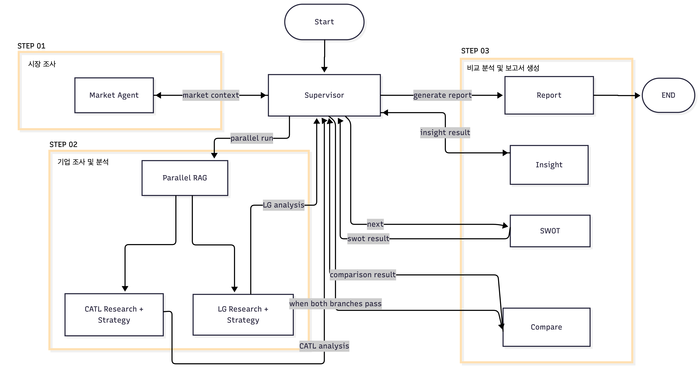
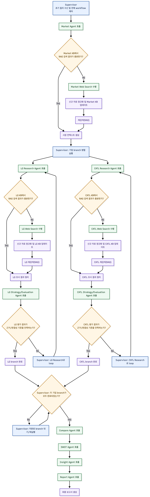

# Battery Market Report AI Agent

> LG에너지솔루션과 CATL의 전략을 데이터 기반으로 비교 분석하고, 의사결정에 활용 가능한 시장 보고서를 생성하는 멀티 에이전트 시스템

- 핵심 목표 : **비교 가능성, 근거성, 추적 가능성**을 갖춘 배터리 시장 리포트를 자동 생성
- 분석 파이프라인 : `시장 분석` → `기업별 조사/분석` → `비교` → `SWOT` → `인사이트 생성` → `보고서 생성`
- `LG 에너지 솔루션`이 보고서의 **주요 독자라는 가정** 하에 작성

## Overview
- **Objective**  
  
  LG에너지솔루션과 CATL의 경쟁력, 전략 차이, 리스크를 동일한 기준으로 비교하고 의사결정에 활용 가능한 시사점을 도출하고 보고서로 작성

- **Method**  
  
  `Supervisor Pattern`, `Parallel Branch`, `RAG-first Retrieval`, `Web Search Fallback` 구조를 결합해 신뢰도 높은 분석 흐름 구성

- **Output**  
  
  배터리 시장 전략 분석 보고서
  - Executive Summary, 시장 분석, 기업별 전략 분석, 비교표, 기업별 SWOT, 전략 인사이트, References

## ⭐️ Key Features

| Key Feature | 설명 | 예시 |
|---|---|---|
| **LG / CATL 데이터 오염 분리** | LG와 CATL을 별도 브랜치와 별도 KB로 분리해 수집, 검증, 분석을 수행함으로써 기업 간 데이터 혼입과 컨텍스트 오염을 방지한다. | `LG KB`, `CATL KB`를 분리하고 `lg_research_node`, `catl_research_node`가 각자 자기 기업 데이터만 사용하도록 설계 |
| **RAG-first + Web Search fallback 기반 보강 루프** | 기본적으로 KB/RAG를 우선 사용하고, 자료 부족/자료 노후/출처 편향/반증 부족/비교 불가능 상태가 감지되면 Web Search로 보강한 뒤 retry/loop를 수행한다. | 긍정 자료만 모으지 않도록 risk query, negative query, counter-evidence 관점 고려 → criteria와 control strategy에 반영 |
| **SO/ST/WO/WT 전략 인사이트 도출** | 비교 분석 결과를 기반으로 SWOT과 SO/ST/WO/WT 전략 인사이트까지 도출하여 실제 전략 판단에 활용 가능한 보고서를 생성한다. | `Compare -> SWOT -> SO/ST/WO/WT -> Report` 흐름을 통해 “CATL 대비 LG의 공급망 리스크 대응 강화 필요” 같은 실행형 시사점 도출 |
| **공통 7개 평가 기준 기반 비교** | LG와 CATL에 동일한 7개 평가 기준을 적용해 결과를 구조적으로 비교할 수 있고, 해석의 일관성과 설명 가능성이 높아진다. | 포트폴리오 다양성, 기술 경쟁력, 시장 대응력, 공급망 전략, 고객/파트너 구조, 글로벌 확장성, 리스크 대응력 기준으로 양사 비교표 생성 |
| **근거 추적 가능성** | 각 분석 결과와 보고서 항목을 source id 및 metadata와 연결해, 최종 문장이 어떤 자료를 바탕으로 생성되었는지 역추적할 수 있다. | 비교 결과의 특정 문장에 연결된 `source_id`, `title`, `publisher`, `date`를 통해 원문 근거를 확인하고 최종 References에 반영 |


## Multi-Agent & Role
- `Supervisor Agent`: 실행 순서 제어, validation 판단, retry/loop 분기, 브랜치 동기화
- `Market Agent`: 시장 환경 구조화 및 공통 분석 프레임 생성
- `LG Research Agent`: LG 관련 자료 수집 및 검증
- `CATL Research Agent`: CATL 관련 자료 수집 및 검증
- `LG Strategy Agent`: LG 전략 분석
- `CATL Strategy Agent`: CATL 전략 분석
- `Synthesis Agent`: 비교 분석, SWOT 생성, 전략 인사이트 도출, 최종 보고서 생성

## Architecture



`Supervisor Pattern with Parallel Branch` 구조를 사용

- 크게 3단계로 구성된 workflow에서 `Supervisor`가 각 단계의 결과를 검증하고 다음 실행 단계를 결정한다.
- `LGES`와 `CATL` 브랜치는 병렬 실행되며, branch별 retry/loop 정책을 독립적으로 판단하고 실행한다.
- `compare_node`는 두 브랜치가 모두 pass 상태일 때만 실행된다.

## Workflow



## Directory Structure
```text
.
├── README.md                          # 프로젝트 소개 및 사용 개요
├── README.img/                        # README에 삽입하는 아키텍처/
├── battery_market_report_agent/       # 메인 애플리케이션 패키지
├── rag_data/                          # 기본 RAG 지식 문서
├── scripts/                           # 보조 실행/점검 스크립트
└── 설계 산출물/                          # 상세 설계 문서 및 원본 다이어그램
```

## Tech Stack

| Category | Details |
|----------|---------|
| Framework | LangGraph, LangChain, Python |
| LLM | OpenAI API (`gpt-4.1-mini` 기본값) |
| Vector DB | Qdrant |
| Retrieval | QdrantVectorStore + FAISS (in-memory augmentation) |
| Web Search | Tavily |
| Embedding | BAAI/bge-m3 (다국어 지원, 8192 토큰 지원) |
| Runtime Pattern | Static KB + Runtime Augmentation |
| State Management | TypedDict-based Workflow State |

## Contributors 

**[TEAM : Parity]**  

- 김유빈 : Supervisor Pattern 기반 설계, RAG-first + Web Search fallback 기반 보강 루프 설계, Architecture 설계
- 양예원 : AI Agentic Workflow 설계, 비교 분석 및 SWOT/전략 인사이트 도출 로직 설계, Architecture 설계