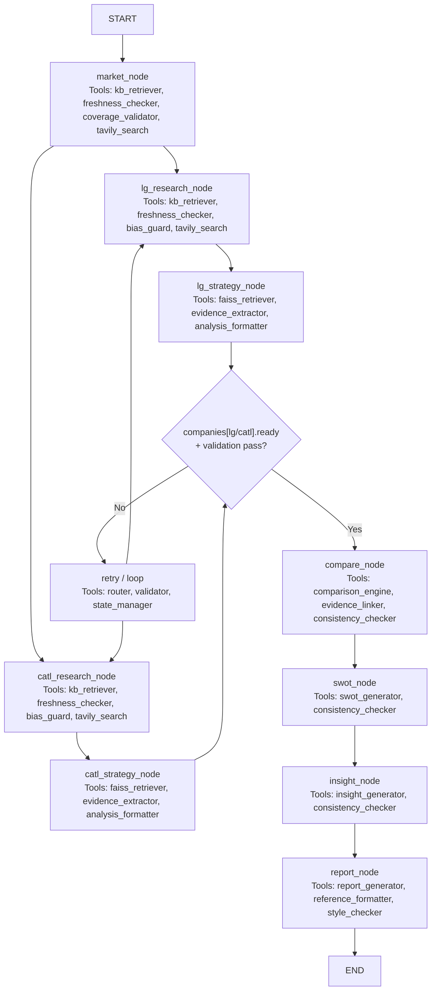

# 설계 산출물_v2.2.3

# 설계 산출물_v2

# 01. 개요

> 본 프로젝트는 글로벌 전기차 및 배터리 산업 환경 변화 속에서 LG에너지솔루션과 CATL의 전략을 데이터 기반으로 비교·분석하기 위한 AI Agentic Workflow 설계를 목표로 한다.
> 

이를 위해 시장 환경 분석부터 기업별 전략 구조화, 비교 분석, SWOT 및 전략적 인사이트 도출, 최종 보고서 생성까지의 전 과정을 체계적으로 정의한다.

RAG 기반 데이터 수집, 기업별 컨텍스트 분리, Supervisor 중심 제어 전략을 통해 분석의 신뢰성과 일관성을 확보하고, 의사결정에 활용 가능한 수준의 전략 보고서 생성 구조를 설계한다.

# 02. Workflow

## 2-1. AI Agentic Workflow

### 2-1-1. Goal (Outcome 중심 재정의)

> 본 보고서는 LG에너지솔루션을 중심으로 자사 전략 수립에 필요한 인사이트 도출을 목적으로 한다.
> 

> Agent Goal :
글로벌 배터리 시장 변화 속에서 LG에너지솔루션과 CATL의 포트폴리오 다각화 전략을 구조적으로 분석하여, **의사결정자가 두 기업의 경쟁력, 전략적 차이, 리스크를 비교 판단하고 전략 선택에 활용할 수 있는 보고서를 생성한다.**
> 

### 2-1-2. Desired Outcome (업무 관점 구체화)

> 항목내용대상LG에너지솔루션 vs CATL변화**비교 가능한 전략 구조로 재정리**결정/행동전략 방향 설정범위EV/ESS/기술/공급망/글로벌 전략 중심
> 

### 2-1-3. Criteria

본 workflow는 최종 보고서의 분석 품질뿐 아니라, 병렬 멀티에이전트 구조에서 각 node가 안정적으로 실행되고 다음 단계로 연결될 수 있도록 Criteria를 함께 설계한다. 따라서 결과 품질 기준과 구현 품질 기준, 운영 및 제어 기준을 통합적으로 적용한다.

- **분석 품질 기준**

| Criteria | 정의 | 적용 목적 |
| --- | --- | --- |
| 근거성 | 모든 핵심 주장, 비교 판단, 전략 제안에 출처 또는 정량 데이터가 포함되어야 함 | 근거 없는 분석 및 추측 방지 |
| 완결성 | 시장 분석, 기업 분석, 비교, SWOT, 인사이트, Summary, Reference 등 필수 산출물이 모두 포함되어야 함 | 결과 누락 방지 |
| 일관성 | LG와 CATL에 동일한 평가 기준을 적용하고, 단계 간 결과가 서로 모순되지 않아야 함 | 비교 가능성 및 분석 신뢰성 확보 |
| 구조성 | 시장 → 기업 → 비교 → SWOT → 인사이트 → 보고서 흐름이 유지되어야 함 | workflow 논리 유지 |
| 균형성 | LG와 CATL 서술 비중 및 강점/약점 평가가 한쪽으로 과도하게 치우치지 않아야 함 | 편향 방지 |
| 분리성 | LG와 CATL의 데이터, 분석 근거, 컨텍스트가 혼합되지 않아야 함 | 기업별 branch 독립성 확보 |
- **구현 품질 기준**

| Criteria | 정의 | 적용 목적 |
| --- | --- | --- |
| 정규성 | 각 node의 출력은 사전에 정의한 고정 스키마를 따라야 함 | 다음 node가 안정적으로 결과를 활용할 수 있도록 보장 |
| 추적 가능성 | 각 분석 결과가 어떤 source에서 도출되었는지 역추적 가능해야 함 | 검증 가능성 및 Reference 생성 지원 |
| 입력 충족성 | 각 node는 실행 전에 필요한 입력 state가 충분히 채워져 있어야 함 | 불완전 입력으로 인한 실패 방지 |
| 충돌 검출 | 동일 기업 분석 내부 또는 단계 간 결과에 상충되는 진술이 없어야 함 | 자기모순 방지 |
- **운영 및 제어 기준**

| Criteria | 정의 | 적용 목적 |
| --- | --- | --- |
| 불확실성 관리 | 근거가 부족한 항목은 단정하지 않고 “정보 부족” 또는 제한 사항으로 명시해야 함 | hallucination 및 과장 해석 방지 |
| 동기화 가능성 | 병렬 수행된 LG/CATL branch가 모두 검증을 통과한 후에만 compare 단계로 진행해야 함 | 병렬 그래프 안정성 확보 |
| 최신성 적합성 | 보고서 작성 시점 기준으로 핵심 자료가 지나치게 오래되지 않아야 하며, 최신 전략/정책 변화를 반영해야 함 | 오래된 자료에 의한 왜곡 방지 |
| 출처 다양성 | 동일 성향 또는 동일 유형의 출처로만 결론을 만들지 않아야 함 | 편향 완화 및 검증력 확보 |
| 반증 가능성 | 긍정적 근거뿐 아니라 리스크, 부정적 시그널, 반대 근거도 함께 탐색해야 함 | 확증 편향 방지 |
- **7개 평가 기준 (Analysis Criteria)**

| 평가 항목 | 정의 |
| --- | --- |
| 포트폴리오 다양성 | EV, ESS, 배터리 타입 등 사업 확장 범위 |
| 기술 경쟁력 | 성능, 안전성, 차세대 기술 확보 수준 |
| 시장 대응력 | 시장 변화 대응 속도 및 전략 방향 |
| 공급망 전략 | 원재료 확보 및 수직계열화 수준 |
| 고객/파트너 구조 | OEM 및 협력 네트워크 안정성 |
| 글로벌 확장성 | 생산 거점 및 투자 전략 |
| 리스크 대응력 | 정책/원가/기술 변화 대응 능력 |
- **업무적 제약 조건 (Constraints)**

| 항목 | 기준 |
| --- | --- |
| Scope Boundaries | EV/ESS/배터리 전략 중심 (비핵심 사업 제외) |
| Compliance | 추측성 판단 금지, 근거 없는 주장 제한 |
| Formatting | 보고서 구조 (Summary / 본문 / Reference) 유지 |
| Data Separation | LG / CATL 데이터 혼합 금지 |
- **서비스 기준 (Operational)**

| 항목 | 기준 |
| --- | --- |
| Consistency | 반복 실행 시 동일 수준의 분석 결과 유지 |
| Error Handling | 근거 부족 시 “정보 부족” 명시 |
| Stability | Agent 간 결과 품질 편차 최소화 |
| Cost/Latency | 불필요한 검색/호출 최소화 (효율적 RAG) |

### 2-1-4. Task Decomposition

| Task | Objective | Outcome 기여 | Input | Output | Success Criteria | Dependency | Constraint / Control | Failure 대응 |
| --- | --- | --- | --- | --- | --- | --- | --- | --- |
| 1. 시장 환경 구조화 | 배터리 시장 변화 요인을 구조화하여 기업 전략 해석 기준 정의 | 기업 전략을 해석할 공통 프레임 제공 | Market KB, 시장 리포트, 산업 데이터 | 핵심 시장 트렌드 + 분석 기준 변수 | 주요 트렌드 3~5개 도출 + 기업 전략과 연결 가능 + 핵심 정책/기술/공급망 정보 포함 | 없음 (Start) | 우선 RAG 검색, 부족 시 Web Search 분기 | 부족/노후 시 Web Search 후 KB 보강 Loop |
| 2. LG 데이터 수집 및 검증 | LG 전략 분석에 필요한 신뢰성 있는 자료 확보 및 분리 | 근거 기반 LG 분석 가능 | LG KB, 공식 IR, Annual Report, 웹 검색 | LG 데이터셋 (출처 포함) | LG 데이터 완전 분리 + 출처 포함 + 7개 기준 커버 가능 | Task 1 | 우선 RAG 검색, 부족 시 Web Search 분기 + CATL 자료 포함 금지 | 부족/노후 시 Web Search 후 KB 보강 Loop |
| 3. CATL 데이터 수집 및 검증 | CATL 전략 분석에 필요한 신뢰성 있는 자료 확보 및 분리 | 근거 기반 CATL 분석 가능 | CATL KB, 기업 보고서, 웹 검색 | CATL 데이터셋 (출처 포함) | CATL 데이터 완전 분리 + 출처 포함 + 7개 기준 커버 가능 | Task 1 | 우선 RAG 검색, 부족 시 Web Search 분기 + LG 자료 포함 금지 | 부족/노후 시 Web Search 후 KB 보강 Loop |
| 4. LG 전략 분석 | LG 전략을 평가 기준(7개)에 따라 구조화 | 비교 가능한 LG 전략 구조 생성 | LG 데이터 + 시장 프레임 | 기준별 분석 + 근거 + 강/약점 | 7개 기준 모두 포함 + 근거 존재 | Task 2 | CATL 정보 사용 금지 | 근거 부족 시 재검색 |
| 5. CATL 전략 분석 | CATL 전략을 동일 기준으로 구조화 | 비교 가능한 CATL 전략 구조 생성 | CATL 데이터 + 시장 프레임 | 기준별 분석 + 근거 + 강/약점 | 7개 기준 모두 포함 + 근거 존재 | Task 3 | LG 정보 사용 금지 | 재검색 Loop |
| 6. 기준 기반 비교 분석 | 동일 기준으로 두 기업 비교 및 전략 차이 도출 | 의사결정 가능한 비교 구조 생성 | LG 분석 + CATL 분석 | 비교표 + 우위/열위 + 차이점 | 동일 기준 적용 + 근거 기반 비교 | Task 4, 5 | 새로운 정보 생성 금지 | 이전 Task 재검토 |
| 7. SWOT 생성 | 기업별 전략/비교 결과 기반 내부·외부 요인 구조화 | 전략 도출을 위한 구조적 기반 생성 | 비교 결과 + 시장 프레임 + 기업별 분석 결과 | LG SWOT + CATL SWOT | 기업별 S/W/O/T 완결 + 내부/외부 구분 명확 + 근거 기반 | Task 6 | 기업별 SWOT 분리 유지 | 비교 결과 재검토 |
| 8. 인사이트 (SO/ST/WO/WT) 생성 | SWOT을 기반으로 실행 가능한 전략 도출 | 의사결정 가능한 전략 인사이트 생성 | SWOT 결과 | 근거가 충분한 전략 유형만 선별한 인사이트 | 도출된 전략 간 논리 연결 + 실행 가능성 + 불필요한 유형 미포함 | Task 7 | SWOT 기반 생성 (추측 금지) | SWOT 재검토 |
| 9. 최종 보고서 생성 | 분석 결과를 의사결정용 보고서로 구조화 | 최종 Deliverable 생성 | 전체 분석 결과 | 핵심 결론 중심 Executive Summary + 표 기반 비교 + 기업별 SWOT + 선별 전략 인사이트 + 상세 시사점 + Reference | 구조 완결 + 기준 반영 + 결론 중심 요약 + 표/섹션 형식 준수 | Task 8 | 요약 ≠ 단순 축약 (결론 중심) | 구조 재정리 |

### 2-1-5. Control Strategy

병렬 구조를 고려하여 각 branch는 독립적인 retry/loop 정책을 가지며, 통합 단계는 양쪽 branch가 모두 검증을 통과한 이후에만 실행된다. 또한 자료 수집 단계는 `RAG 우선 검색 → 부족 판단 → 필요 시 Web Search 분기 → 새 자료를 KB에 편입 → 재검색` 순서를 따른다.

- **시장 / 데이터 수집 단계 (RAG 영역)**

| 조건 | 판단 기준 | 대응 |
| --- | --- | --- |
| 데이터 부족 | 정량 데이터 < 20건 또는 핵심 기준 커버 불충분 | Web Search 분기 → 새 자료 KB 편입 → RAG 재검색 |
| 데이터 노후 | 핵심 자료 발행일이 과도하게 오래되었거나 최신 전략/정책 변화 미반영 | Web Search 분기 → 최신 자료 추가 → RAG 재검색 |
| 출처 부족 | 근거 없는 핵심 주장 존재 | Retry |
| 데이터 품질 낮음 | 신뢰도 낮은 출처 다수 또는 source 추적 불가 | Loop (source 필터링 강화) |
| 출처 편향 | 공식 자료/산업 자료/비판 자료 중 한쪽에 과도하게 치우침 | Web Search 분기 → 반대 성격 자료 추가 |
| 확증 편향 위험 | 긍정적 자료만 존재하고 리스크/부정 근거가 거의 없음 | Web Search 분기 → negative / risk / criticism query 추가 |
| 기업 분리 실패 | LG/CATL 데이터 혼입 발생 | Fail 후 해당 branch 재수집 |
- **기업 전략 분석 단계**

| 조건 | 판단 기준 | 대응 |
| --- | --- | --- |
| 기준 누락 | 7개 평가 기준 일부 미포함 | Retry |
| 근거 부족 | 분석 항목 중 근거 없는 항목 존재 | Loop → 해당 기업 Research Node |
| 분석 불균형 | 양사 출력 스키마 불일치 또는 기준 적용 깊이 차이 과다 | Retry |
| 자기모순 | 동일 기업 분석 내부에 상충 진술 존재 | Retry |
- **비교 / SWOT / 인사이트 단계**

| 조건 | 판단 기준 | 대응 |
| --- | --- | --- |
| branch 미완료 | 한쪽 branch가 아직 pass 상태가 아님 | 대기 또는 미완료 branch 재실행 |
| 비교 근거 부족 | 우위 판단에 근거 없음 | Loop → 해당 기업 Strategy Node |
| SWOT 구조 오류 | S/W/O/T 누락 또는 내부/외부 구분 불명확 | Retry |
| 인사이트 미연결 | SWOT과 전략 연결 안됨 | Retry |
- **최종 보고서 단계**

| 조건 | 판단 기준 | 대응 |
| --- | --- | --- |
| 구조 불완전 | Summary/Reference 누락 | Retry |
| Summary 오류 | 결론 중심 아님 또는 길이 초과 | Retry |
| Reference 오류 | 형식 불일치 또는 실제 미사용 출처 포함 | Retry |
| 균형성 저하 | LG/CATL 서술 비중 과도하게 치우침 | Retry |

**Loop 범위 제한**

| 단계 | Loop 허용 범위 |
| --- | --- |
| RAG 단계 | 우선 KB 검색, 부족/노후/편향 판단 시 Web Search 분기 후 KB 보강 가능 |
| 전략 분석 단계 | 해당 기업의 Research Node까지만 Loop 가능 |
| 비교 이후 | 새로운 기업 데이터 직접 추가 수집 금지. 단, 비교 근거가 부족한 경우 해당 기업 Research/Strategy 단계로 되돌아가 보강 |
| 보고서 단계 | Loop 없음, 재작성만 가능 |

**Retry / Fail 정책**

| 항목 | 기준 |
| --- | --- |
| 최대 Retry 횟수 | Node별 2회 |
| 최대 Loop 횟수 | Branch별 2회 |
| Fail 조건 | 기준 미달 상태로 Retry/Loop 초과 시 |
| Fail 대응 | “정보 부족” 또는 부분 결과 반환 |

### 2-1-6. Structure

> **Supervisor Pattern with Parallel Branch**
> 
- 이유: Task 간 선후관계가 분명하고, 후반 통합 단계는 앞 단계 산출물이 모두 필요하므로 중앙 통제가 적합하다.
- 구현 원칙: `Task`는 업무 단계, `Agent`는 역할 단위, `Node`는 LangGraph에서 실제 실행되는 단계로 구분한다.
- 병렬 구간: `market_node` 이후 `LG branch`와 `CATL branch`를 병렬 수행한다.
- 동기화 지점: `compare_node`는 양쪽 branch가 모두 `pass`일 때만 진입한다.

## 2-2. Agent 설계

### 2-2-1. Agent와 Node 정의

본 설계에서는 설명과 책임 분리를 위해 `Agent`와 `Node`를 구분한다.

- `Task`: 업무적으로 수행해야 하는 단계
- `Agent`: 해당 업무를 담당하는 역할 주체
- `Node`: LangGraph 안에서 실제로 실행되는 함수/체인 단위

따라서 하나의 Agent가 여러 Node를 담당할 수 있다.

| Agent | 주요 역할 | Input | Output | 분리 이유 |
| --- | --- | --- | --- | --- |
| Supervisor Agent | 전체 Workflow 제어, Task 순서 관리, 실패 시 재실행 판단 | 사용자 요청, 각 Agent 결과 | 다음 실행 지시, 최종 결과 취합 | Task 간 Dependency가 분명하므로 중앙 통제가 필요함 |
| Market Agent | 배터리 시장 환경 구조화, 공통 분석 프레임 생성 | 시장 리포트, 산업 데이터 | 시장 트렌드, 분석 프레임 | 기업 공통 맥락을 제공하는 역할이므로 기업 분석과 분리 |
| LG Research Agent | LG 관련 데이터 수집 및 검증 | LG KB, 웹 검색 결과, 기업 보고서, 기사 | LG 데이터셋, 출처 정보 | LG/CATL 컨텍스트 오염 방지를 위해 기업별 분리 |
| CATL Research Agent | CATL 관련 데이터 수집 및 검증 | CATL KB, 웹 검색 결과, 기업 보고서, 기사 | CATL 데이터셋, 출처 정보 | LG/CATL 컨텍스트 오염 방지를 위해 기업별 분리 |
| LG Strategy Agent | LG 전략을 기준에 따라 분석 | LG 데이터셋, 시장 프레임 | LG 기준별 전략 분석 결과 | 수집과 분석은 역할이 다르고, 기업별 독립 분석이 필요함 |
| CATL Strategy Agent | CATL 전략을 기준에 따라 분석 | CATL 데이터셋, 시장 프레임 | CATL 기준별 전략 분석 결과 | 수집과 분석은 역할이 다르고, 기업별 독립 분석이 필요함 |
| Synthesis Agent | 비교, SWOT, 인사이트, 최종 보고서 생성 | 시장 프레임, LG 분석 결과, CATL 분석 결과 | 비교표, SWOT, SO/ST/WO/WT, 최종 보고서 | 후반 단계는 통합과 해석 중심이며 최종 Deliverable 생성 역할이 같음 |

| Node | 담당 Agent | 주요 역할 | Input State | Output State |
| --- | --- | --- | --- | --- |
| `market_node` | Market Agent | 시장 환경 구조화 및 공통 프레임 생성 | `user_query` | `market_context` |
| `lg_research_node` | LG Research Agent | LG 자료 수집 및 검증 | `user_query`, `market_context`, `companies["lg"]` | `companies["lg"].raw_docs` |
| `catl_research_node` | CATL Research Agent | CATL 자료 수집 및 검증 | `user_query`, `market_context`, `companies["catl"]` | `companies["catl"].raw_docs` |
| `lg_strategy_node` | LG Strategy Agent | LG 전략 분석 | `market_context`, `companies["lg"].raw_docs` | `companies["lg"].analysis` |
| `catl_strategy_node` | CATL Strategy Agent | CATL 전략 분석 | `market_context`, `companies["catl"].raw_docs` | `companies["catl"].analysis` |
| `compare_node` | Synthesis Agent | 기준별 비교 분석 | `market_context`, `companies["lg"].analysis`, `companies["catl"].analysis` | `comparison_result` |
| `swot_node` | Synthesis Agent | SWOT 구조화 | `market_context`, `comparison_result` | `swot_result` |
| `insight_node` | Synthesis Agent | SO/ST/WO/WT 인사이트 생성 | `market_context`, `swot_result` | `insight_result` |
| `report_node` | Synthesis Agent | 최종 보고서 및 Reference 생성 | `market_context`, `companies`, `comparison_result`, `swot_result`, `insight_result` | `final_report`, `references` |

### 2-2-2. RAG 적용 대상 선정

본 설계의 retrieval 기본 원칙은 `RAG-first, Web Search fallback`이다.

- 먼저 사전 적재된 KB에서 검색한다.
- 자료가 충분하면 해당 KB 결과만으로 다음 단계로 진행한다.
- 자료가 부족하거나 오래되었거나 출처가 편향된 경우에만 Web Search로 분기한다.
- Web Search 결과는 정규화 후 다시 KB에 편입하고, 그 뒤 재검색을 수행한다.

| # | 적용 대상 Task | 관련 Agent | 적용 이유 | 활용 문서 예시 |
| --- | --- | --- | --- | --- |
| 1 | 시장 환경 구조화 | Market Agent | 시장 변화와 산업 트렌드는 우선 Market KB에서 검색하고, 부족 시 Web Search로 최신 자료를 보강해야 함 | 산업 리포트, 시장 보고서, 정책 기사 |
| 2 | LG 데이터 수집 및 검증 | LG Research Agent | LG 관련 근거 자료를 우선 LG KB에서 검색하고, 부족 시 Web Search로 보강해야 함 | IR 자료, Annual Report, 뉴스, 인터뷰 |
| 3 | CATL 데이터 수집 및 검증 | CATL Research Agent | CATL 관련 근거 자료를 우선 CATL KB에서 검색하고, 부족 시 Web Search로 보강해야 함 | 기업 보고서, 기사, 시장 분석 자료 |
| 4 | LG 전략 분석 | LG Strategy Agent | 수집된 LG 문서에서 기준별 근거를 찾아 구조화해야 하며, 근거가 약하면 Research 단계로 loop 되어야 함 | LG 데이터셋 |
| 5 | CATL 전략 분석 | CATL Strategy Agent | 수집된 CATL 문서에서 기준별 근거를 찾아 구조화해야 하며, 근거가 약하면 Research 단계로 loop 되어야 함 | CATL 데이터셋 |
| 6 | 비교 분석 보강 | Synthesis Agent | 비교 단계에서 근거 연결이 약한 항목을 기존 문서 기준으로 보강 검증해야 함 | LG/CATL 분석 결과, 출처 메타데이터 |

### 2-2-3. 적용할 Embedding 모델

| 항목 | 내용 |
| --- | --- |
| 모델 | BAAI/bge-m3 |
| 특징 | 다국어 지원, 8192 토큰 지원 |
| 지원 모델 | dense + sparse + ColBERT |
| 선정 이유 | 다국어 검색 성능을 고려하여 선택 |

### 2-2-4. Retrieval / Search Stack

| 항목 | 선택 |
| --- | --- |
| Web Search | Tavily |
| Vector DB | FAISS |
| Vector DB 운영 방식 | Static KB + Runtime In-memory 보강 |
| Document Store | Market KB / LG KB / CATL KB 분리 저장 |
| Retrieval 방식 | `KB Retrieval first → 부족 시 Tavily → KB 편입 → 재검색` |

선정 이유는 다음과 같다.

- `Tavily`: 최신 뉴스, 정책 변화, 신규 투자/제휴 발표 등 KB에 아직 없는 자료를 보강하기 적합하다.
- `FAISS`: 경량이고 빠르며, KB와 런타임 보강 문서를 함께 검색하기 적합하다.
- `Static KB + Runtime In-memory 보강`: 최신성과 재현성의 균형을 확보할 수 있다.
- `문서 저장소 분리`: `Market KB / LG KB / CATL KB`를 분리해 기업 데이터 오염을 줄일 수 있다.

### 2-2-5. Web Search 분기 조건 및 편향 방지 설계

Web Search는 기본 경로가 아니라 `RAG 결과가 충분하지 않을 때만` 실행하는 fallback 도구로 설계한다.

**Web Search 분기 조건**

| 조건 | 판단 기준 |
| --- | --- |
| 자료 부족 | 7개 평가 기준 중 핵심 기준 다수가 비어 있거나, 필요한 정량 근거가 부족함 |
| 자료 노후 | 핵심 자료 발행일이 지나치게 오래되었거나 최신 전략/정책 변화가 반영되지 않음 |
| 출처 다양성 부족 | 공식 자료, 산업 자료, 보도자료, 비판 기사 간 균형이 무너짐 |
| 반증 부족 | 긍정적 자료만 있고, 리스크·부정적 신호·실적 악화·규제 부담 관련 자료가 없음 |
| 비교 불가능 | LG/CATL 중 한쪽만 풍부하고 다른 한쪽은 근거가 빈약해 동일 기준 비교가 불가능함 |

**확증 편향 방지 설계**

| 설계 원칙 | 적용 방식 |
| --- | --- |
| 대칭 질의 | LG와 CATL에 동일한 질의 틀 적용 |
| 양면 질의 | `growth/opportunity`뿐 아니라 `risk/challenge/pressure/criticism` 질의도 함께 수행 |
| 출처 다양성 확보 | 공식 자료, 산업 보고서, 규제 자료, 일반 뉴스, 비판 기사 조합 유지 |
| 반증 근거 수집 | 강점 주장이 있으면 반대 근거 또는 제약 근거도 최소 1개 이상 탐색 |
| source filtering | 한 매체 또는 한 기업 보도자료만으로 결론 내리지 않음 |
| evidence traceability | Web Search로 들어온 자료도 source_id와 메타데이터를 부여해 이후 단계에서 추적 가능하게 함 |

### 2-2-6. Vector DB 설계 (PoC 기준)

본 프로젝트의 Vector DB는 `시장 공통 맥락`과 `기업별 branch`를 구조적으로 분리하기 위해 `Market KB`, `LG KB`, `CATL KB`의 3개 논리 저장소로 설계한다.

즉, 시장 분석은 `Market KB`를 우선 조회하고, 기업별 분석은 각자의 기업 KB만 우선 조회하도록 구성하여 branch contamination을 방지한다.

PoC 단계에서는 별도의 문서 메타 저장소를 추가로 두지 않고, `FAISS 인덱스 + chunk 내부 메타데이터`만으로 운영한다.

이는 현재 목표가 대규모 운영 최적화보다 `RAG-first + Web Search fallback` 흐름 검증에 있기 때문이다.

**기본 설계 원칙**

- `논리 분리`: `Market KB / LG KB / CATL KB`를 분리해 시장 자료와 기업 자료, LG와 CATL 자료가 혼합되지 않도록 한다.
- `chunk 단위 저장`: 문서는 원문 그대로가 아니라 retrieval 가능한 chunk 단위로 저장한다.
- `metadata 포함 chunk`: 별도 메타 저장소 대신 각 chunk가 source 정보와 retrieval 판단용 메타데이터를 함께 가진다.
- `static + runtime augmentation`: 사전 적재된 KB를 기본으로 사용하고, Web Search로 수집한 신규 자료는 실행 중 임시로 추가하여 함께 검색한다.
- `state와 분리`: Vector DB 자체는 state에 넣지 않고, state에는 retrieval 결과와 진단 정보만 저장한다.

**KB 구조**

| KB | 역할 | 포함 자료 예시 | 우선 사용하는 Node |
| --- | --- | --- | --- |
| `Market KB` | 시장 공통 배경, 정책, 기술, 공급망, 경쟁 환경 저장 | 산업 리포트, 정책 문서, 기술 트렌드 보고서, 공급망 분석 자료 | `market_node` |
| `LG KB` | LG에너지솔루션 전용 근거 저장 | Annual Report, IR 자료, 보도자료, 투자/공장 발표, 인터뷰, 기사 | `lg_research_node`, `lg_strategy_node` |
| `CATL KB` | CATL 전용 근거 저장 | 기업 보고서, 실적 자료, 공장/투자 발표, 기술 기사, 인터뷰 | `catl_research_node`, `catl_strategy_node` |

**저장 단위**

- 권장 chunk 크기: `500~1200 tokens`
- overlap: `80~150 tokens`
- 기준: 하나의 chunk가 독립적으로 의미를 가지면서도, 검색 시 지나치게 잘게 쪼개지지 않도록 유지

**Chunk 메타데이터 필드**

PoC에서는 별도 메타 저장소를 두지 않으므로, 아래 필드는 chunk와 함께 관리하는 것을 전제로 한다.

| 필드 | 설명 |
| --- | --- |
| `chunk_id` | chunk 고유 식별자 |
| `source_id` | 원문 문서 식별자 |
| `kb_type` | `market`, `lg`, `catl` 중 어느 KB에 속하는지 표시 |
| `company` | `market`, `lg`, `catl` 구분 |
| `source_type` | `annual_report`, `ir`, `news`, `policy`, `industry_report`, `press_release` 등 |
| `title` | 문서 제목 |
| `publisher` | 발행 기관 또는 매체 |
| `published_at` | 발행 시점 |
| `content` | 실제 chunk 본문 |
| `criterion_tags` | 7개 평가 기준 중 어떤 기준과 연결되는지 표시 |
| `sentiment_side` | `positive`, `neutral`, `risk`, `critical` 등 양면성 판단용 태그 |
| `region_tags` | `global`, `us`, `eu`, `china` 등 지역 태그 |

특히 `criterion_tags`와 `sentiment_side`는 중요하다.

이 두 필드가 있어야 7개 기준 커버리지 점검과 확증 편향 방지 로직을 retrieval 단계에서 함께 적용할 수 있다.

**운영 구조**

PoC 단계에서는 각 KB를 아래 두 레이어로 나누어 관리하는 것이 적합하다.

- `Static KB`
    - 사전 적재된 문서로 만든 기본 FAISS 인덱스
- `Runtime Augmentation`
    - Web Search로 새로 찾은 자료를 실행 중 임시 편입한 인메모리 인덱스

따라서 실제 retrieval 흐름은 아래와 같다.

1. 해당 node가 우선 `Static KB`를 검색한다.
2. coverage, freshness, diversity, counter-evidence를 검사한다.
3. 기준 미달이면 Web Search를 수행한다.
4. 신규 자료를 정규화하고 chunk로 분할한다.
5. 이를 해당 KB의 `Runtime Augmentation` 레이어에 추가한다.
6. `Static KB + Runtime Augmentation`를 함께 검색한다.
7. 최종 retrieval 결과만 state에 반영한다.

이 구조의 장점은 다음과 같다.

- 최신성: 사전 KB에 없는 최신 자료를 실행 중 보강할 수 있다.
- 분리성: LG/CATL 자료를 구조적으로 분리할 수 있다.
- 단순성: PoC 단계에서 별도 문서 DB나 메타 저장소 없이도 retrieval 흐름을 검증할 수 있다.
- 추적 가능성: chunk에 source_id와 메타데이터를 포함하므로 이후 보고서 단계에서 출처 추적이 가능하다.

**State와의 관계**

Vector DB 자체는 state에 저장하지 않는다.

대신 state에는 retrieval 결과와 retrieval 판단 근거만 남긴다.

- `market_retrieval_status`, `market_retrieval_diagnostics`
- `companies[company].retrieval_status`
- `companies[company].retrieval_diagnostics`
- `companies[company].web_search_history`
- `companies[company].kb_update_count`
- `source_registry`

즉 Vector DB는 `검색 인프라`, state는 `실행 및 판단 기록`으로 역할을 분리한다.

**PoC 설계 선택 이유**

실무 운영 단계에서는 벡터 인덱스 외에 별도 메타 저장소를 함께 두는 편이 더 안정적일 수 있다.

그러나 본 프로젝트는 PoC 단계이므로, 현재는 `FAISS 기반 Vector DB + chunk 메타데이터 포함 문서 구조`만으로도 충분하다.

이는 구현 복잡도를 낮추면서도 `RAG-first → Web Search fallback → KB 보강 → 재검색` 흐름을 검증하기에 적절하다.

## 2-3. Workflow 설계

### 2-3-1. State

본 workflow의 state는 `입력 상태`, `데이터 상태`, `제어 상태`, `retrieval 상태`로 구분한다. 특히 LG와 CATL 분석은 병렬 branch로 수행되므로, 기업별 데이터 state를 분리하여 관리하고, 통합 분석 단계에서는 두 branch의 완료 여부를 함께 검증한다. 또한 본 설계는 `RAG-first, Web Search fallback` 구조를 따르므로, 단순히 문서와 분석 결과만 저장하는 것이 아니라 `왜 KB만으로 충분했는지`, `왜 Web Search가 필요했는지`, `어떤 조건에서 KB 보강이 일어났는지`까지 state에 남겨 Supervisor가 분기 근거를 추적할 수 있어야 한다.

| State | 유형 | 설명 | 생성 Node | 사용 Node |
| --- | --- | --- | --- | --- |
| `user_query` | Input | 사용자 요청 및 분석 범위 | `START` | 전체 Node |
| `market_context` | Data | 시장 환경 분석 결과 및 공통 분석 프레임 | `market_node` | `lg_strategy_node`, `catl_strategy_node`, `compare_node`, `swot_node`, `insight_node`, `report_node` |
| `companies` | Data | 기업별 branch state 저장소. `companies["lg"]`, `companies["catl"]` 구조로 관리 | `START` 이후 branch node들 | 전체 branch node, `compare_node`, `report_node` |
| `market_retrieval_status` | Retrieval | Market KB 검색 sufficiency, 최신성, 출처 다양성, 반증 확보 여부를 요약한 상태 | `market_node` | Supervisor, `market_node` validator |
| `market_retrieval_diagnostics` | Retrieval | 시장 단계의 coverage/freshness/diversity/counter-evidence 세부 판정 근거 | `market_node` | Supervisor, `market_node`, logging |
| `market_web_search_history` | Retrieval | 시장 단계에서 수행한 Web Search query, 분기 사유, 편입 결과 기록 | `market_node` | Supervisor, auditing, logging |
| `comparison_result` | Data | LG와 CATL의 기준별 비교 결과 | `compare_node` | `swot_node`, `report_node` |
| `swot_result` | Data | 비교 결과 기반 SWOT 결과 | `swot_node` | `insight_node`, `report_node` |
| `insight_result` | Data | SO/ST/WO/WT 전략 인사이트 | `insight_node` | `report_node` |
| `final_report` | Data | 최종 보고서 본문 및 Summary | `report_node` | `END` |
| `source_registry` | Data | 각 단계에서 사용 가능한 출처 메타데이터와 source id 목록 | `market_node`, `lg_research_node`, `catl_research_node` | `compare_node`, `swot_node`, `insight_node`, `report_node` |
| `references` | Data | 최종 보고서에 실제 사용된 출처 목록 | `report_node` | `END` |
| `step_status` | Control | 전역 node의 실행 상태 (`pending`, `running`, `pass`, `fail`) | 각 Node / Supervisor | Supervisor |
| `retry_counts` | Control | 전역 node의 retry 횟수 | Supervisor | Supervisor |
| `loop_counts` | Control | 전역 통합 단계의 loop 횟수 | Supervisor | Supervisor |
| `current_step` | Control | 현재 실행 중인 node | Supervisor | Supervisor |
| `error_message` | Control | 실패 원인 및 오류 메시지 | 각 Node / Supervisor | Supervisor |
| `validation_result` | Control | 전역 node의 검증 결과 및 판정 사유 | Validator / Supervisor | Supervisor |

`companies` 내부의 branch state는 최소한 아래 정보를 포함하는 것을 전제로 한다.

- `raw_docs`: 해당 기업 branch에서 확보한 문서와 정량 근거
- `analysis`: 해당 기업 전략 분석 결과
- `step_status`: branch 내부 node 상태
- `retry_counts`, `loop_counts`: branch 내부 재시도/loop 관리
- `validation_result`: branch 내부 판정 기록
- `ready`: 비교 단계 진입 가능 여부
- `retrieval_status`: 해당 기업 KB 검색 sufficiency 요약
- `retrieval_diagnostics`: coverage, freshness, diversity, counter-evidence 진단 결과
- `web_search_history`: fallback Web Search query와 분기 사유 기록
- `kb_update_count`: Web Search 이후 branch KB 보강 횟수

즉 state는 단순 저장소가 아니라, `Supervisor가 왜 다음 분기를 선택했는지 설명 가능한 실행 기록`의 역할도 함께 수행한다.

특히 retrieval 관련 상태는 `KB만으로 충분한가`, `Web Search fallback이 필요한가`, `편향 완화가 추가로 필요한가`를 판단하는 직접 근거로 사용된다.

### 2-3-2. Graph 흐름

본 workflow는 `Supervisor Pattern`을 기반으로 구성하며, `Market 분석` 이후 `LG branch`와 `CATL branch`를 병렬로 수행한 뒤, 두 branch가 모두 검증을 통과하면 통합 분석 단계로 진입한다. 자료 수집 단계는 `KB Retrieval first → 부족 판단 → 필요 시 Web Search → KB 편입 → 재검색` 흐름을 따르며, 이후 비교 분석, SWOT, 인사이트, 보고서 작성 순으로 진행한다.

```
START
-> market_node
-> [lg_research_node || catl_research_node]
-> [lg_strategy_node || catl_strategy_node]
-> compare_node
-> swot_node
-> insight_node
-> report_node
-> END
```

**Mermaid Graph**


```bash
flowchart TD
    S["Supervisor<br/>초기 질의 수신 및 전체 workflow 제어"] --> M0["Market Agent 호출"]
    M0 --> M1{"Market KB에서<br/>RAG 검색 결과가 충분한가?"}

    M1 -->|Yes| M2["시장 컨텍스트 생성"]
    M1 -->|No| MWS["Market Web Search 수행"]
    MWS --> MKB["신규 자료 정규화 및 Market KB 업데이트"]
    MKB --> MR["재검색(RAG)"]
    MR --> M2["시장 컨텍스트 생성"]

    M2 --> P["Supervisor: 기업 branch 병렬 실행"]

    P --> L0["LG Research Agent 호출"]
    P --> C0["CATL Research Agent 호출"]

    L0 --> L1{"LG KB에서<br/>RAG 검색 결과가 충분한가?"}
    L1 -->|Yes| L2["LG 조사 결과 정리"]
    L1 -->|No| LWS["LG Web Search 수행"]
    LWS --> LKB["신규 자료 정규화 및 LG KB 업데이트"]
    LKB --> LR["LG 재검색(RAG)"]
    LR --> L2["LG 조사 결과 정리"]

    C0 --> C1{"CATL KB에서<br/>RAG 검색 결과가 충분한가?"}
    C1 -->|Yes| C2["CATL 조사 결과 정리"]
    C1 -->|No| CWS["CATL Web Search 수행"]
    CWS --> CKB["신규 자료 정규화 및 CATL KB 업데이트"]
    CKB --> CR["CATL 재검색(RAG)"]
    CR --> C2["CATL 조사 결과 정리"]

    L2 --> LS["LG Strategy/Evaluation Agent 호출"]
    C2 --> CS["CATL Strategy/Evaluation Agent 호출"]

    LS --> LV{"LG 평가 결과가<br/>근거/완결성 기준을 만족하는가?"}
    LV -->|Yes| LDone["LG branch 완료"]
    LV -->|No| LLoop["Supervisor: LG Research로 loop"]
    LLoop --> L0

    CS --> CV{"CATL 평가 결과가<br/>근거/완결성 기준을 만족하는가?"}
    CV -->|Yes| CDone["CATL branch 완료"]
    CV -->|No| CLoop["Supervisor: CATL Research로 loop"]
    CLoop --> C0

    LDone --> Sync{"Supervisor: 두 기업 branch가<br/>모두 완료되었는가?"}
    CDone --> Sync

    Sync -->|No| Wait["Supervisor: 미완료 branch 대기/재실행"]
    Wait --> Sync
    Sync -->|Yes| CMP["Compare Agent 호출"]

    CMP --> SWOT["SWOT Agent 호출"]
    SWOT --> INS["Insight Agent 호출"]
    INS --> REP["Report Agent 호출"]
    REP --> END["최종 보고서 생성"]

    classDef sup fill:#e8f1ff,stroke:#2f5ea8,color:#1b2d4f;
    classDef agent fill:#eef9f1,stroke:#2d7a46,color:#174526;
    classDef decision fill:#fff6e5,stroke:#b7791f,color:#5c3d00;
    classDef store fill:#f5f0ff,stroke:#6b46c1,color:#3f2a74;

    class S,P,LLoop,CLoop,Sync,Wait sup;
    class M0,L0,C0,LS,CS,CMP,SWOT,INS,REP,MWS,LWS,CWS agent;
    class M1,L1,C1,LV,CV,Sync decision;
    class MKB,LKB,CKB,MR,LR,CR,M2,L2,C2,LDone,CDone,END store;
```

**Graph 제어 원칙**

- `Supervisor`는 각 node의 결과를 확인하고 다음 node를 결정한다.
- `LG branch`와 `CATL branch`는 독립적으로 병렬 수행되며, 각 branch는 자체 retry/loop를 가진다.
- `compare_node`는 병렬 branch의 동기화 지점이며, 두 branch가 모두 완료되어야 진입 가능하다.
- `compare_node` 이후 단계에서는 새로운 기업 데이터를 수집하지 않고, 기존 분석 결과와 source metadata를 기반으로만 통합 분석을 수행한다.
- `report_node`는 최종 산출물 생성 단계이며, 구조 수정은 가능하지만 새로운 분석 논점 추가는 허용하지 않는다.

### 2-3-3. Node별 Tool Mapping

각 node는 역할에 따라 필요한 tool 조합이 다르며, 특히 연구 단계와 통합 분석 단계의 tool 사용 목적을 구분해야 한다.

| Node | 주요 목적 | 필요 Tool | Tool 사용 목적 |
| --- | --- | --- | --- |
| `market_node` | 시장 환경 구조화 및 프레임 생성 | `static_kb_retriever`, `runtime_kb_merger`, `freshness_checker`, `coverage_validator`, `diversity_checker`, `tavily_search`, `document_loader` | Market KB 우선 검색, 부족/노후/편향 판단, 필요 시 Web Search 자료를 Runtime Augmentation에 편입 후 재검색 |
| `lg_research_node` | LG 자료 수집 및 검증 | `static_kb_retriever`, `runtime_kb_merger`, `freshness_checker`, `coverage_validator`, `bias_guard`, `tavily_search`, `document_loader`, `source_filter` | LG KB 우선 검색, 부족/노후/편향 판단, 필요 시 최신 자료 및 반증 자료를 Runtime Augmentation에 편입 후 재검색 |
| `catl_research_node` | CATL 자료 수집 및 검증 | `static_kb_retriever`, `runtime_kb_merger`, `freshness_checker`, `coverage_validator`, `bias_guard`, `tavily_search`, `document_loader`, `source_filter` | CATL KB 우선 검색, 부족/노후/편향 판단, 필요 시 최신 자료 및 반증 자료를 Runtime Augmentation에 편입 후 재검색 |
| `lg_strategy_node` | LG 전략 분석 | `branch_faiss_retriever`, `evidence_extractor`, `analysis_formatter` | LG branch에서 확정된 문서 집합을 기준으로 7개 기준별 근거 재검색, 요약 구조화, schema 맞춤 출력 |
| `catl_strategy_node` | CATL 전략 분석 | `branch_faiss_retriever`, `evidence_extractor`, `analysis_formatter` | CATL branch에서 확정된 문서 집합을 기준으로 7개 기준별 근거 재검색, 요약 구조화, schema 맞춤 출력 |
| `compare_node` | LG vs CATL 비교 분석 | `comparison_engine`, `evidence_linker`, `consistency_checker` | 동일 기준 비교, source 연결, 기준 불일치 점검 |
| `swot_node` | SWOT 구조화 | `swot_generator`, `consistency_checker` | 비교 결과를 SWOT 형식으로 재구성, 내부/외부 구분 검증 |
| `insight_node` | SO/ST/WO/WT 전략 인사이트 생성 | `insight_generator`, `consistency_checker` | SWOT 기반 전략 생성, 논리 연결 검증 |
| `report_node` | 최종 보고서 및 참고문헌 작성 | `report_generator`, `reference_formatter`, `style_checker` | Summary/본문 생성, Reference 포맷 정리, 길이 및 구조 점검 |
| `Supervisor` | 분기 및 재시도 제어 | `router`, `validator`, `state_manager` | validation 결과 판정, 다음 node 결정, retry/loop 관리 |

여기서 `static_kb_retriever`는 사전 적재된 `Market KB / LG KB / CATL KB`를 조회하는 역할이고, `runtime_kb_merger`는 Web Search로 보강한 신규 문서를 현재 실행의 Runtime Augmentation 레이어에 합쳐 재검색 가능하게 하는 역할이다.

또한 `branch_faiss_retriever`는 research 단계에서 최종 확정된 branch 문서 집합을 기준으로 전략 분석 시점의 근거를 다시 정교하게 찾기 위한 보조 retrieval 계층이다.

### 2-3-4. Node별 Criteria Mapping

| Node | 주요 역할 | Input State | Output State | 적용 Criteria | 검증 항목 | 실패 시 대응 |
| --- | --- | --- | --- | --- | --- | --- |
| `market_node` | 시장 환경 구조화 및 공통 분석 프레임 생성 | `user_query` | `market_context` | 근거성, 완결성, 구조성, 정규성, 추적 가능성, 최신성 적합성 | Market KB에서 핵심 트렌드/정책/기술/공급망 자료 확보, 최신성 부족 시 Web Search 보강, 출처 포함, 정해진 구조로 출력 | 자료 부족/노후 시 Web Search 분기 후 KB 보강 |
| `lg_research_node` | LG 관련 자료 수집 및 검증 | `user_query`, `market_context`, `companies["lg"]` | `companies["lg"].raw_docs` | 근거성, 완결성, 분리성, 정규성, 추적 가능성, 입력 충족성, 최신성 적합성, 출처 다양성, 반증 가능성 | LG KB 우선 검색, 7개 기준 커버 확인, 최신 자료 포함, CATL 자료 혼입 없음, 긍정/부정 양면 자료 확보 | 자료 부족/노후/편향 시 Web Search 분기 후 KB 보강 Loop |
| `catl_research_node` | CATL 관련 자료 수집 및 검증 | `user_query`, `market_context`, `companies["catl"]` | `companies["catl"].raw_docs` | 근거성, 완결성, 분리성, 정규성, 추적 가능성, 입력 충족성, 최신성 적합성, 출처 다양성, 반증 가능성 | CATL KB 우선 검색, 7개 기준 커버 확인, 최신 자료 포함, LG 자료 혼입 없음, 긍정/부정 양면 자료 확보 | 자료 부족/노후/편향 시 Web Search 분기 후 KB 보강 Loop |
| `lg_strategy_node` | LG 전략 분석 | `market_context`, `companies["lg"].raw_docs` | `companies["lg"].analysis` | 근거성, 완결성, 일관성, 분리성, 정규성, 추적 가능성, 불확실성 관리, 충돌 검출 | 7개 평가 기준 모두 포함, 각 항목별 근거 존재, LG 데이터만 사용, 시장 프레임과 연결, 모순 없는 분석 구조 | 근거 부족 시 `lg_research_node` loop, 항목 누락 시 `lg_strategy_node` retry |
| `catl_strategy_node` | CATL 전략 분석 | `market_context`, `companies["catl"].raw_docs` | `companies["catl"].analysis` | 근거성, 완결성, 일관성, 분리성, 정규성, 추적 가능성, 불확실성 관리, 충돌 검출 | 7개 평가 기준 모두 포함, 각 항목별 근거 존재, CATL 데이터만 사용, 시장 프레임과 연결, 모순 없는 분석 구조 | 근거 부족 시 `catl_research_node` loop, 항목 누락 시 `catl_strategy_node` retry |
| `compare_node` | LG vs CATL 비교 분석 | `market_context`, `companies["lg"].analysis`, `companies["catl"].analysis` | `comparison_result` | 근거성, 일관성, 구조성, 균형성, 정규성, 추적 가능성, 동기화 가능성, 충돌 검출 | 양사 branch 모두 pass 상태, 동일 7개 기준 적용, 우위/열위 판단에 근거 존재, 비교표 구조 유지, 한쪽 편향 없음 | branch 미완료 시 대기, 기준 불일치 시 전략 node로 loop, 근거 부족 시 전략 node로 loop |
| `swot_node` | 기업별 SWOT 구조화 | `market_context`, `comparison_result`, `companies["lg"].analysis`, `companies["catl"].analysis` | `swot_result` | 근거성, 구조성, 일관성, 정규성, 추적 가능성, 충돌 검출 | LG SWOT와 CATL SWOT가 각각 존재, 각 SWOT에 S/W/O/T 모두 포함, 내부/외부 구분 명확, 비교 결과와 모순 없음 | 항목 누락 시 `swot_node` retry, 근거 약하면 `compare_node` loop |
| `insight_node` | SO/ST/WO/WT 전략 인사이트 생성 | `market_context`, `swot_result` | `insight_result` | 근거성, 일관성, 구조성, 정규성, 추적 가능성, 불확실성 관리 | SWOT 기반으로만 생성, 실행 가능한 전략 제시, 실제로 도출된 전략 유형만 포함, 미도출 유형은 억지 생성 금지, SWOT과 논리 연결 | 연결 부족 시 `insight_node` retry, 입력 부족 시 `swot_node` loop |
| `report_node` | 최종 보고서 생성 | `market_context`, `companies`, `comparison_result`, `swot_result`, `insight_result` | `final_report`, `references` | 완결성, 구조성, 근거성, 균형성, 정규성, 추적 가능성, Formatting, 불확실성 관리 | 핵심 결론 중심 Executive Summary 포함, 4.1 비교표 포함, 기업별 SWOT 2개 포함, 도출된 전략 유형만 제시, 상세 시사점 포함, 실제 사용 출처만 기재, 형식 준수 | 형식 오류 시 `report_node` retry, 입력 누락 시 이전 node 재검토 |

### 2-3-5. 핵심 Output Schema 원칙

정규성과 추적 가능성을 실제 구현에 반영하기 위해 주요 output state는 아래 원칙을 따른다.

| Output State | 권장 구조 |
| --- | --- |
| `companies[company].raw_docs` | `[{source_id, source_type, title, date, publisher, excerpt, numeric_facts, reliability_note}]` |
| `companies[company].analysis` | `{criteria_scores_or_summary, criteria_sections[7개 기준], strengths, weaknesses, source_ids}` |
| `comparison_result` | `{comparison_table, key_differences, competitive_advantages, source_ids}` |
| `swot_result` | `{lg: {strengths, weaknesses, opportunities, threats, source_ids}, catl: {strengths, weaknesses, opportunities, threats, source_ids}}` |
| `insight_result` | `{selected_strategies: [{type, title, rationale, related_swot, source_ids}], strategic_implications, source_ids}` |
| `final_report` | `{summary: {key_conclusions, key_insights, decision_points}, body_sections, conclusion_or_implications}` |

위 구조를 따르면 병렬 branch의 출력 형식을 맞출 수 있고, `compare_node` 이후 통합 단계에서 schema mismatch를 줄일 수 있다.

### 2-3-6. Comparison Engine 설계 원칙

`comparison_engine`은 단순 LLM 자유서술 생성기가 아니라, 양사 분석 결과를 동일 기준으로 정렬하고 차이를 구조적으로 계산하는 비교 모듈로 설계하는 것이 바람직하다.

**입력**

- `companies["lg"].analysis`
- `companies["catl"].analysis`
- 각 분석 결과에 연결된 `source_ids`

**출력**

- `comparison_table`
- `key_differences`
- `competitive_advantages`
- `source_ids`

**권장 구현 방식**

1. 두 기업 분석 결과를 7개 평가 기준 기준으로 정렬한다.
2. 각 기준마다 `LG 요약`, `CATL 요약`, `근거 source_ids`를 추출한다.
3. 기준별로 다음 항목을 계산한다.
    - 공통점
    - 차이점
    - 상대 우위/열위
    - 우위 판단의 근거
4. 비교 결과를 table schema로 정규화한다.
5. LLM은 마지막에 `차이점 요약`과 `전략적 해석`에만 사용하고, 비교 골격 자체는 규칙 기반으로 먼저 만든다.

**권장 처리 순서**

```python
def comparison_engine(lg_analysis, catl_analysis):
    rows = []

    for criterion in ANALYSIS_CRITERIA:
        lg_item = find_criterion(lg_analysis, criterion)
        catl_item = find_criterion(catl_analysis, criterion)

        row = {
            "criterion": criterion,
            "lg_summary": lg_item["summary"],
            "catl_summary": catl_item["summary"],
            "lg_strengths": lg_item["strengths"],
            "catl_strengths": catl_item["strengths"],
            "difference": derive_difference(lg_item, catl_item),
            "advantage": determine_advantage(lg_item, catl_item),
            "evidence": list(set(lg_item["source_ids"] + catl_item["source_ids"])),
        }
        rows.append(row)

    return {
        "comparison_table": rows,
        "key_differences": summarize_key_differences(rows),
        "competitive_advantages": summarize_advantages(rows),
        "source_ids": collect_source_ids(rows),
    }
```

**핵심 구현 원칙**

- 비교 단위는 반드시 `7개 평가 기준`으로 고정한다.
- 먼저 `규칙 기반 정렬/비교`를 수행하고, 그 다음에 `LLM 요약`을 사용한다.
- `advantage`는 근거가 부족하면 `undetermined`로 남긴다.
- 한쪽 데이터가 빈약하면 억지 비교를 하지 않고 `정보 부족`으로 표시한다.
- 최종 `comparison_result`에는 반드시 source id를 남겨 downstream node가 재활용할 수 있게 한다.

**권장 내부 함수**

| 함수 | 역할 |
| --- | --- |
| `find_criterion` | 기업 분석 결과에서 특정 평가 기준 section 추출 |
| `derive_difference` | 두 section의 핵심 차이 계산 |
| `determine_advantage` | 근거 기반 상대 우위 판정 |
| `summarize_key_differences` | 전체 비교표에서 핵심 차이 요약 |
| `summarize_advantages` | 기준별 우위 결과를 종합해 경쟁 우위 요약 |
| `collect_source_ids` | 전체 비교 결과에 사용된 source id 집계 |

## 2-4. Diagram

- 코드
    
    ```bash
    ---
    config:
      layout: fixed
    ---
    flowchart TB
        ST(["Start"]) --> S["Supervisor"]
        S -- run --> M["Market Agent"]
        M -- market context --> S
        S -- parallel run --> P["Parallel RAG"]
        P --> LG["LG Research + Strategy"] & CATL["CATL Research + Strategy"]
        LG -- LG analysis --> S
        CATL -- CATL analysis --> S
        S -- when both branches pass --> C["Compare"]
        C -- comparison result --> S
        S -- next --> W["SWOT"] & I["Insight"]
        W -- swot result --> S
        S -- generate report --> R["Report"]
        R --> ED(["END"])
        I -- insight result --> S
        n1["<br>"]
        n2["<br>"]
        n3["기업 조사 및 분석"]
        n4["비교 분석 및 보고서 생성"]
        n5["<br>"]
        n6["시장 조사"]
        n7["STEP 01"]
        n8["STEP 02"]
        n9["STEP 03"]
    
        n1@{ shape: proc}
        n2@{ shape: proc}
        n3@{ shape: text}
        n4@{ shape: text}
        n5@{ shape: proc}
        n6@{ shape: text}
        n7@{ shape: text}
        n8@{ shape: text}
        n9@{ shape: text}
        classDef Sky stroke-width:1px, stroke-dasharray:none, stroke:#374D7C, fill:#E2EBFF, color:#374D7C
        style n1 fill:transparent,stroke:#FFE0B2,stroke-width:4px,stroke-dasharray: 0
        style n2 fill:transparent,stroke:#FFE0B2,stroke-width:4px,stroke-dasharray: 0
        style n3 color:#000000
        style n4 color:#000000
        style n5 fill:transparent,stroke:#FFE0B2,stroke-width:4px,stroke-dasharray: 0
        style n6 color:#000000
        style n7 color:#000000
        style n8 color:#000000
        style n9 color:#000000
    ```
    


## 2-5. Implementation Blueprint

### 2-5-1. LangGraph State Schema (TypedDict 초안)

실제 LangGraph 구현 시에는 문서형 state 정의를 코드형 schema로 옮겨야 한다. 아래는 현재 설계를 기준으로 한 `TypedDict` 초안이다.

```python
from typing import Any, Dict, List, Literal, NotRequired, TypedDict

NodeStatus = Literal["pending", "running", "pass", "fail"]
ValidationDecision = Literal["pass", "retry", "loop", "fail"]

class SourceMeta(TypedDict):
    source_id: str
    source_type: str
    title: str
    date: str
    publisher: str
    excerpt: str
    numeric_facts: List[str]
    reliability_note: str

class CriteriaSection(TypedDict):
    criterion: str
    summary: str
    evidence: List[str]
    strengths: List[str]
    weaknesses: List[str]
    source_ids: List[str]

class CompanyAnalysis(TypedDict):
    company: str
    criteria_sections: List[CriteriaSection]
    executive_takeaway: str
    strengths: List[str]
    weaknesses: List[str]
    source_ids: List[str]
    uncertainty_notes: List[str]

class ComparisonResult(TypedDict):
    comparison_table: List[Dict[str, Any]]
    key_differences: List[str]
    competitive_advantages: List[str]
    source_ids: List[str]

class CompanySwot(TypedDict):
    strengths: List[str]
    weaknesses: List[str]
    opportunities: List[str]
    threats: List[str]
    source_ids: List[str]

class SwotResult(TypedDict):
    lg: CompanySwot
    catl: CompanySwot

class InsightResult(TypedDict):
    so: List[str]
    st: List[str]
    wo: List[str]
    wt: List[str]
    strategic_implications: List[str]
    source_ids: List[str]

class FinalReport(TypedDict):
    summary: Dict[str, Any]
    body_sections: List[Dict[str, Any]]
    conclusion_or_implications: str

class ValidationRecord(TypedDict):
    decision: ValidationDecision
    reason: str
    missing_items: List[str]
    target_node: NotRequired[str]

class RetrievalStatus(TypedDict):
    sufficient: bool
    used_web_search: bool
    reason: List[str]
    last_updated_at: str

class RetrievalDiagnostics(TypedDict):
    coverage_ok: bool
    freshness_ok: bool
    diversity_ok: bool
    counter_evidence_ok: bool
    missing_criteria: List[str]
    stale_sources: List[str]
    source_type_distribution: Dict[str, int]
    notes: List[str]

class WebSearchRecord(TypedDict):
    query: str
    trigger_reason: List[str]
    added_source_ids: List[str]
    executed_at: str

class BranchState(TypedDict):
    # 해당 기업 branch에서 수집한 문서와 정량 근거 목록.
    raw_docs: NotRequired[List[SourceMeta]]

    # 해당 기업의 전략 분석 결과.
    analysis: NotRequired[CompanyAnalysis]

    # branch 내부 node 상태.
    # 예: {"research_node": "pass", "strategy_node": "running"}
    step_status: Dict[str, NodeStatus]

    # branch 내부 retry 횟수.
    retry_counts: Dict[str, int]

    # branch 내부 loop 횟수.
    loop_counts: Dict[str, int]

    # branch 내부 validation 결과.
    validation_result: Dict[str, ValidationRecord]

    # branch 완료 여부.
    ready: bool

    # branch 수준 retrieval 결과 요약.
    # KB만으로 충분했는지, Web Search fallback이 필요했는지 기록한다.
    retrieval_status: NotRequired[RetrievalStatus]

    # branch 수준 retrieval 품질 진단.
    # coverage/freshness/diversity/counter-evidence 판정과 세부 사유를 저장한다.
    retrieval_diagnostics: NotRequired[RetrievalDiagnostics]

    # branch에서 실행한 Web Search 기록.
    web_search_history: NotRequired[List[WebSearchRecord]]

    # branch KB 보강 횟수.
    kb_update_count: int

class WorkflowState(TypedDict):
    # 사용자 요청 원문. 전체 workflow의 출발점이다.
    user_query: str

    # 시장 환경 분석 결과와 공통 분석 프레임.
    # LG/CATL branch가 공통으로 참조한다.
    market_context: NotRequired[Dict[str, Any]]

    # Market KB retrieval 결과 요약.
    market_retrieval_status: NotRequired[RetrievalStatus]

    # 시장 단계 retrieval 품질 진단.
    market_retrieval_diagnostics: NotRequired[RetrievalDiagnostics]

    # 시장 단계 Web Search fallback 기록.
    market_web_search_history: NotRequired[List[WebSearchRecord]]

    # 기업별 branch state 저장소.
    # 예: {"lg": BranchState(...), "catl": BranchState(...)}
    companies: Dict[str, BranchState]

    # LG/CATL 비교 분석 결과.
    # compare_node 이후 SWOT, report 단계에서 사용한다.
    comparison_result: NotRequired[ComparisonResult]

    # 비교 결과를 기반으로 도출한 SWOT 구조.
    swot_result: NotRequired[SwotResult]

    # SWOT 기반의 SO/ST/WO/WT 전략 인사이트.
    insight_result: NotRequired[InsightResult]

    # 최종 보고서 결과물.
    # summary, body_sections, conclusion을 포함한다.
    final_report: NotRequired[FinalReport]

    # source_id를 key로 하는 출처 메타데이터 저장소.
    # 각 단계가 사용 가능한 근거를 누적 관리한다.
    source_registry: NotRequired[Dict[str, SourceMeta]]

    # 최종 보고서에 실제 사용된 reference 문자열 목록.
    references: NotRequired[List[str]]

    # 전역 통합 node의 실행 상태.
    # 예: {"market_node": "pass", "compare_node": "pending"}
    step_status: Dict[str, NodeStatus]

    # 전역 통합 node의 retry 횟수.
    retry_counts: Dict[str, int]

    # 전역 통합 단계 loop 횟수.
    loop_counts: Dict[str, int]

    # 현재 실행 중인 node 이름.
    # logging, debugging, supervisor 제어에 활용한다.
    current_step: NotRequired[str]

    # 최근 실패 원인 또는 예외 메시지.
    error_message: NotRequired[str]

    # 전역 통합 node의 validation 결과.
    validation_result: Dict[str, ValidationRecord]
```

**Schema 설계 원칙**

- `WorkflowState`는 전체 그래프에서 공유되는 전역 state로 사용한다.
- 기업별 데이터는 `companies["lg"]`, `companies["catl"]` 내부에 격리하여 branch contamination을 방지한다.
- branch 내부 상태와 validation은 `BranchState` 안에서 관리하고, 통합 단계 상태는 전역 state에서 관리한다.
- retrieval 관련 상태는 `전역 시장 단계`와 `기업별 branch 단계`로 분리해 관리한다.
- `RetrievalStatus`는 Supervisor가 `다음 단계로 진행할지 / Web Search로 분기할지`를 빠르게 판단하는 요약 상태로 사용한다.
- `RetrievalDiagnostics`는 coverage, freshness, diversity, counter-evidence 판정 근거를 남겨 fallback 분기의 설명 가능성을 확보한다.
- `WebSearchRecord`는 어떤 질의가 어떤 이유로 실행되었는지 남겨 편향 통제와 감사 가능성을 지원한다.
- `validation_result`는 node별 판정 결과를 기록하여 router가 다음 경로를 결정하는 기준으로 활용한다.
- `source_registry`는 source id와 메타데이터를 누적 저장하여 최종 Reference 생성과 추적 가능성을 지원한다.

### 2-5-2. Conditional Edges / Router Logic

병렬 branch와 retry/loop 정책을 안정적으로 운영하기 위해 각 node 뒤에는 validation 결과에 따라 다음 node를 결정하는 conditional edge가 필요하다.

**기본 라우팅 원칙**

- `decision == "pass"`이면 다음 정상 흐름으로 이동한다.
- `decision == "retry"`이면 현재 node를 다시 실행한다.
- `decision == "loop"`이면 `target_node`로 되돌아간다.
- `decision == "fail"`이면 부분 결과를 정리한 뒤 `report_node` 또는 종료 분기로 이동한다.
- 단, research 계열 node에서는 `retrieval_status`와 `retrieval_diagnostics`를 함께 읽어 `KB만으로 충분한 상태인지`, `Web Search fallback이 필요한지`, `source_filtering 강화 후 재시도가 필요한지`를 구분해야 한다.

**권장 Router 함수 구조**

```python
def route_after_node(state: WorkflowState, node_name: str) -> str:
    result = state["validation_result"][node_name]
    decision = result["decision"]

    # research 계열 node는 retrieval 상태를 함께 확인한다.
    # 예: sufficient=False 이고 freshness/diversity/counter_evidence가 미달이면
    # 현재 node 내부에서 Web Search fallback 분기를 수행하거나
    # 같은 research node를 재실행하도록 결정할 수 있다.

    if decision == "pass":
        return "next"
    if decision == "retry":
        return node_name
    if decision == "loop":
        return result["target_node"]
    return "report_node"
```

### 2-5-3. Node별 Edge 규칙

| 현재 Node | pass 시 이동 | retry 시 이동 | loop 시 이동 | fail 시 이동 |
| --- | --- | --- | --- | --- |
| `market_node` | `lg_research_node`, `catl_research_node` 병렬 시작 | `market_node` | `market_node` | `report_node` |
| `lg_research_node` | `lg_strategy_node` | `lg_research_node` | `lg_research_node` | `report_node` |
| `catl_research_node` | `catl_strategy_node` | `catl_research_node` | `catl_research_node` | `report_node` |
| `lg_strategy_node` | branch 완료 표시 후 동기화 대기 | `lg_strategy_node` | `lg_research_node` | `report_node` |
| `catl_strategy_node` | branch 완료 표시 후 동기화 대기 | `catl_strategy_node` | `catl_research_node` | `report_node` |
| `compare_node` | `swot_node` | `compare_node` | `lg_strategy_node`, `catl_strategy_node`, 필요 시 `lg_research_node` 또는 `catl_research_node` | `report_node` |
| `swot_node` | `insight_node` | `swot_node` | `compare_node` | `report_node` |
| `insight_node` | `report_node` | `insight_node` | `swot_node` | `report_node` |
| `report_node` | `END` | `report_node` | 없음 | `END` |

### 2-5-4. 병렬 Branch 동기화 로직

`compare_node`는 아래 조건을 모두 만족할 때만 실행한다.

```python
def can_run_compare(state: WorkflowState) -> bool:
    return (
        state["companies"]["lg"]["ready"]
        and state["companies"]["catl"]["ready"]
        and state["companies"]["lg"]["step_status"].get("strategy_node") == "pass"
        and state["companies"]["catl"]["step_status"].get("strategy_node") == "pass"
    )
```

동기화가 되지 않은 경우 router는 `compare_node`로 진입하지 않고, 아직 완료되지 않은 branch를 계속 수행하거나 대기 상태를 유지한다.

### 2-5-5. Supervisor 라우팅 기준

Supervisor는 각 node의 결과를 직접 다시 생성하지 않고, 아래 기준만 담당한다.

1. 현재 실행 가능한 node 판단
2. `validation_result`와 `retrieval_status / retrieval_diagnostics`를 함께 읽어 next step 결정
3. retry/loop 횟수 한도 확인
4. branch 동기화 확인
5. fail 시 부분 결과를 `report_node`로 전달

즉 Supervisor는 `분석을 수행하는 Agent`가 아니라, `실행 순서와 분기 규칙을 관리하는 Orchestrator`로 제한하는 것이 바람직하다.

### 2-5-6. 구현 시 권장 함수 분리

실제 코드에서는 node와 validator를 분리하는 것이 유지보수에 유리하다.

| 함수 유형 | 예시 |
| --- | --- |
| 실행 함수 | `run_market_node`, `run_lg_research_node`, `run_compare_node` |
| 검증 함수 | `validate_market_output`, `validate_company_analysis`, `validate_report_output` |
| 라우터 함수 | `route_after_market`, `route_after_lg_strategy`, `route_after_compare` |
| 동기화 함수 | `can_run_compare`, `mark_branch_ready` |

이 구조를 따르면 하나의 node가 너무 많은 책임을 갖지 않게 되고, validator 교체나 기준 조정도 수월해진다.

### 2-5-7. 구현용 Mermaid Graph with Tool Labels



### 2-5-8. End-to-End 실행 흐름 설명

본 workflow는 `공통 맥락은 전역 state에 저장`하고, `기업별 조사 및 분석은 branch state에 격리 저장`한 뒤, `비교 이후 결과를 다시 전역 state로 통합`하는 방식으로 동작한다.

이때 Supervisor는 단순히 node 실행 순서만 관리하는 것이 아니라, `retrieval_status`, `retrieval_diagnostics`, `validation_result`, `ready` 같은 상태를 읽어 `다음 단계 진행`, `동일 node retry`, `Web Search fallback`, `이전 research 단계로 loop` 중 어떤 분기를 선택할지 결정한다.

**1. 초기 상태 생성**

실행 시작 시 `WorkflowState`에는 최소한 아래 정보가 존재한다.

- `user_query`
- `market_retrieval_status`, `market_retrieval_diagnostics`
- `companies["lg"]`
- `companies["catl"]`
- 전역 `step_status`, `retry_counts`, `loop_counts`, `validation_result`

이 시점에는 기업별 분석 결과나 보고서 데이터는 아직 비어 있다.

**2. Market 분석 단계**

`market_node`는 사용자 요청을 바탕으로 배터리 시장 환경과 공통 분석 프레임을 생성한다.

- 사용 tool: `kb_retriever`, `freshness_checker`, `coverage_validator`, `tavily_search`
- 처리 방식:
    - 먼저 Market KB에서 시장 기사, 산업 보고서, 정책 문서를 검색
    - 커버리지, 최신성, 출처 다양성을 검사
    - 자료가 부족하거나 오래되었거나 편향되었을 때만 Tavily로 보강 검색
    - 새 자료를 Market KB에 편입한 뒤 다시 retrieval 수행
- 저장 결과:
    - `market_context`
    - `market_retrieval_status`
    - `market_retrieval_diagnostics`
    - `market_web_search_history`
    - `source_registry` 일부

즉 market 단계의 RAG는 시장 환경을 구조화하고, 이후 LG/CATL branch가 공통으로 참조할 분석 프레임을 만드는 역할을 한다.

**3. 기업별 조사 단계 (병렬)**

이후 `lg_research_node`와 `catl_research_node`가 병렬로 실행된다.

각 node는 전역 state를 보더라도, 실제로는 자기 branch 내부 state만 읽고 쓴다.

- `lg_research_node`
    - 입력: `user_query`, `market_context`, `companies["lg"]`
    - 출력: `companies["lg"].raw_docs`
- `catl_research_node`
    - 입력: `user_query`, `market_context`, `companies["catl"]`
    - 출력: `companies["catl"].raw_docs`

이 단계의 RAG는 다음 순서로 동작한다.

1. 먼저 각 기업 KB에서 retrieval 수행
2. 7개 평가 기준 커버리지, 최신성, 출처 다양성, 반증 자료 존재 여부를 검사
3. 기준 미달 시 Tavily로 Web Search 분기
4. 검색 결과를 정규화하고 source metadata를 부여
5. 새 자료를 해당 기업 KB에 편입
6. KB에서 다시 retrieval 수행
7. source metadata와 함께 branch state에 저장

이 단계에서 중요한 점은 LG 자료는 `companies["lg"]`에만, CATL 자료는 `companies["catl"]`에만 저장된다는 것이다. 따라서 전역 state를 사용하더라도 기업별 raw data는 구조적으로 격리된다.

동시에 각 branch는 아래 상태를 함께 갱신한다.

- `companies[company].retrieval_status`
- `companies[company].retrieval_diagnostics`
- `companies[company].web_search_history`
- `companies[company].kb_update_count`

따라서 Supervisor는 단순히 `문서가 있는가`만 보는 것이 아니라, `왜 현재 자료가 충분한지` 또는 `왜 Web Search를 더 해야 하는지`를 state 근거로 판단할 수 있다.

**4. 기업별 전략 분석 단계 (병렬)**

조사 단계가 끝나면 `lg_strategy_node`와 `catl_strategy_node`가 병렬로 실행된다.

- `lg_strategy_node`
    - 입력: `market_context`, `companies["lg"].raw_docs`
    - 출력: `companies["lg"].analysis`
- `catl_strategy_node`
    - 입력: `market_context`, `companies["catl"].raw_docs`
    - 출력: `companies["catl"].analysis`

이 단계에서는 branch 내부 raw docs를 바탕으로 7개 평가 기준별 분석 결과를 생성한다.

- 각 기준별 요약
- 강점 / 약점
- 근거 문장
- source_ids
- 불확실성 메모

분석 결과가 기준 누락, 근거 부족, 자기모순 등의 조건에 걸리면 validator가 `retry` 또는 `loop`를 결정한다.

- `retry`: 현재 strategy node 재실행
- `loop`: 해당 기업의 research node로 되돌아가 KB 재검색 또는 Web Search 보강 수행

분석이 정상 통과하면 다음 값이 갱신된다.

- `companies["lg"].analysis` 또는 `companies["catl"].analysis`
- `companies[company].step_status["strategy_node"] = "pass"`
- `companies[company].ready = True`

반대로 전략 분석 결과가 통과하지 못하면 Supervisor는 `companies[company].validation_result`와 `companies[company].retrieval_diagnostics`를 함께 보고, 형식 보정 수준이면 `retry`, 근거 부족이나 최신성 부족이면 `research node loop`, 반증 자료 부족이면 `Web Search fallback 포함 research 재수행`으로 분기한다.

**5. 병렬 branch 동기화**

`compare_node`는 양쪽 branch가 모두 완료된 경우에만 실행된다.

즉 아래 조건을 만족해야 한다.

- `companies["lg"].ready == True`
- `companies["catl"].ready == True`
- `companies["lg"].step_status["strategy_node"] == "pass"`
- `companies["catl"].step_status["strategy_node"] == "pass"`

이 구조 덕분에 한 기업 분석이 불완전한 상태에서 비교 단계로 넘어가는 것을 방지할 수 있다.

또한 branch가 `ready` 상태가 되려면 단순히 문서가 존재하는 것만으로는 부족하며, 아래 조건을 만족해야 한다.

- 핵심 평가 기준 커버리지 확보
- 최신 자료 반영
- 출처 다양성 확보
- 긍정/부정 양면 근거 확보

즉 `ready`는 단순 완료 플래그가 아니라, retrieval과 analysis가 모두 기준을 통과했다는 Supervisor 관점의 승인 상태로 해석하는 것이 맞다.

**6. 비교 분석 단계**

`compare_node`는 이제 branch state에 저장된 양사 분석 결과를 읽어 전역 비교 결과를 생성한다.

- 입력:
    - `market_context`
    - `companies["lg"].analysis`
    - `companies["catl"].analysis`
- 출력:
    - `comparison_result`

이 단계의 핵심은 자유 생성이 아니라 `정렬된 구조 비교`이다.

1. 양사 분석 결과를 7개 평가 기준 기준으로 정렬
2. 기준별 차이점 계산
3. 상대 우위/열위 판단
4. 근거 source id 연결
5. 전체 비교표와 핵심 차이 요약 생성

즉 비교 단계부터는 기업별 branch 결과를 통합하지만, 여전히 source 기반 추적은 유지된다.

**7. SWOT 및 인사이트 단계**

비교 결과가 생성되면 후속 단계는 모두 전역 state 중심으로 진행된다.

- `swot_node`
    - 입력: `comparison_result`, `market_context`
    - 출력: `swot_result`
- `insight_node`
    - 입력: `swot_result`, `market_context`
    - 출력: `insight_result`

이 단계에서는 새로운 기업 데이터를 다시 수집하지 않고, 기존 분석 및 비교 결과만 바탕으로 구조화와 전략 도출을 수행한다.

즉,
- `swot_node`는 비교 결과를 S/W/O/T 구조로 재구성하고
- `insight_node`는 이를 다시 SO/ST/WO/WT 전략으로 변환한다.

**8. 최종 보고서 생성 단계**

마지막 `report_node`는 지금까지 축적된 전역 state와 branch state를 모두 읽어 최종 보고서를 생성한다.

- 입력:
    - `market_context`
    - `companies`
    - `comparison_result`
    - `swot_result`
    - `insight_result`
    - `source_registry`
- 출력:
    - `final_report`
    - `references`

이 단계에서 수행하는 작업은 다음과 같다.

1. 핵심 결론, 주요 인사이트, 의사결정 포인트 중심의 Executive Summary 생성
2. 시장 배경 정리
3. LG / CATL 기업별 전략 분석 섹션 정리
4. 7개 평가 기준 기반 비교표와 경쟁 우위 분석 정리
5. LG SWOT, CATL SWOT를 각각 정리
6. SO/ST/WO/WT 중 실제 도출된 전략 유형만 선별하여 정리
7. 단기/중기 대응 방향과 세부 전략 과제를 포함한 종합 시사점 작성
8. 실제 사용된 source id 기준으로 Reference 생성

즉 최종 보고서는 앞 단계에서 만든 branch 분석 결과와 통합 분석 결과를 모두 활용하여 작성된다.

이때 최종 보고서 구조는 아래 원칙을 따른다.

- `summary`: 핵심 결론, 주요 인사이트, 의사결정 포인트를 포함한 구조화된 객체
- `body_sections`: 목차 순서를 따르는 section list
- `conclusion_or_implications`: 최종 시사점 및 실행 방향

**9. 전체 state 흐름 요약**

```
START
-> user_query 초기화
-> market_node
   -> Market KB 검색
   -> 부족/노후/편향 시 Web Search
   -> KB 보강 후 market_context 저장
-> lg_research_node / catl_research_node
   -> 각 기업 KB 검색
   -> 부족/노후/편향 시 Web Search
   -> KB 보강 후 companies["lg"].raw_docs / companies["catl"].raw_docs
-> lg_strategy_node / catl_strategy_node
   -> companies["lg"].analysis
   -> companies["catl"].analysis
   -> companies["lg"].ready = True
   -> companies["catl"].ready = True
-> compare_node
   -> comparison_result
-> swot_node
   -> swot_result
-> insight_node
   -> insight_result
-> report_node
   -> final_report
   -> references
-> END
```

**정리**

이 workflow에서 RAG는 주로 `market_node`, `research_node`, `strategy_node`에서 사용되며, 우선 KB에서 검색한 뒤 부족/노후/편향이 확인될 때만 Web Search로 분기한다.

Web Search 결과는 그대로 쓰지 않고 KB에 편입한 뒤 다시 retrieval하여 분석에 사용한다. 이 과정에서 sufficiency, freshness, diversity, counter-evidence 판정과 fallback 이력은 state에 함께 기록되며, Supervisor는 이 상태를 읽어 분기를 제어한다. 기업별 branch는 `companies["lg"]`, `companies["catl"]`로 분리되어 데이터 오염을 방지하고, 비교 이후 단계에서는 branch 결과를 전역 state로 통합하여 SWOT, 인사이트, 최종 보고서를 생성한다.

# 03. 보고서

```jsx
## 1. Executive Summary
- 핵심 결론
  - LG에너지솔루션과 CATL 비교 결과에서 도출된 최종 판단
  - 평가 기준 전반에서 확인된 우위/열위 및 구조적 차이
- 주요 인사이트
  - 비교 분석과 SWOT 기반으로 도출된 핵심 전략 인사이트
  - LG에너지솔루션 관점에서 우선 검토해야 할 시사점
- 의사결정 포인트
  - 경영진이 바로 참고할 수 있는 전략 선택 포인트와 리스크 요약

## 2. 산업 및 시장 배경

### 2.1 글로벌 배터리 시장 개요
- 시장 규모 및 성장률

### 2.2 기술 및 산업 트렌드
- 배터리 기술 발전 방향
- 정책 및 규제 (IRA, 규제, 정책 등)

### 2.3 경쟁 환경
- 산업 구조
- 주요 경쟁 요소

## 3. 기업별 전략 분석

### 3.1 LG에너지솔루션 전략 분석
- 포트폴리오 전략
- 기술 경쟁력
- 시장 대응 전략
- 공급망 전략
- 고객/파트너 구조
- 글로벌 확장 전략
- 리스크 대응 전략

### 3.2 CATL 전략 분석
- 포트폴리오 전략
- 기술 경쟁력
- 시장 대응 전략
- 공급망 전략
- 고객/파트너 구조
- 글로벌 확장 전략
- 리스크 대응 전략

## 4. 기업 비교 분석

### 4.1 평가 기준별 비교
- 7개 평가 기준을 기준으로 LG에너지솔루션과 CATL을 표 형식으로 비교
- 각 행에는 평가 기준, LG 요약, CATL 요약, 핵심 차이, 상대 우위, 근거 출처를 포함

### 4.2 경쟁 우위 분석
- 기술 / 시장 / 공급망 / 전략적 포지션

### 4.3 핵심 차이점 도출
- 전략 방향성 차이
- 경쟁 구조 상의 위치 차이

## 5. SWOT 분석

### 5.1 LG에너지솔루션 SWOT
- Strength
- Weakness
- Opportunity
- Threat

### 5.2 CATL SWOT
- Strength
- Weakness
- Opportunity
- Threat

## 6. LG 에너지 솔루션의 전략적 인사이트 (SO/ST/WO/WT)

### 6.1 도출된 전략 유형만 제시
- SWOT 조합 결과 실제로 유효한 전략 유형만 선택하여 제시
- SO/ST/WO/WT를 모두 기계적으로 채우지 않고, 근거가 충분한 유형만 포함
- 각 전략에는 관련 SWOT 근거와 실행 방향을 함께 명시

## 7. 종합 시사점
- LG에너지솔루션이 우선 대응해야 할 전략 과제
- CATL 대비 방어가 필요한 영역과 격차 축소가 필요한 영역
- 단기 / 중기 관점에서 실행 가능한 대응 방향
- 포트폴리오, 기술, 공급망, 고객전략 측면의 구체적 시사점
- 향후 모니터링이 필요한 외부 변수와 리스크 요인

## 8. Reference
- 보고서 / 논문 / 기사 / 데이터 출처
```

---